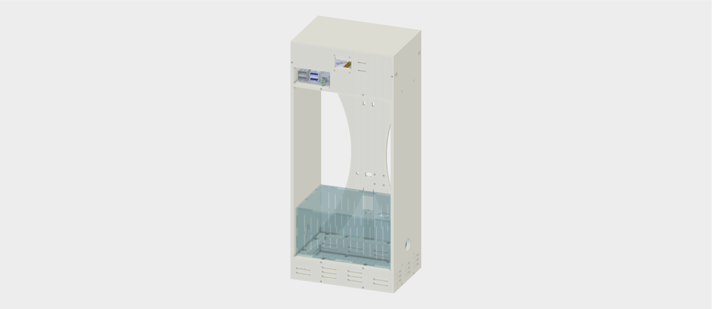

# BEEhaviourLab Apparatus

A comprehensive system for automated behavioural recording of bees in controlled laboratory environments. This repository contains the hardware design files and software implementation for the BEEhaviourLab apparatus.

## Overview

The BEEhaviourLab apparatus is designed for automated recording of bee behaviour in controlled experimental conditions. The system integrates video recording, audio capture, environmental monitoring, and precise timing controls to facilitate high-throughput behavioural studies.

## Repository Structure

### Hardware Assembly
- **`apparatus_assembly/`** - Complete hardware documentation and assembly resources
  - `lasercutting_templates/` - DXF files for laser cutting the apparatus housing and experimental chambers
    - `3mmBox.dxf` - 3mm clear perspex chamber components
    - `5mmBox.dxf` - 5mm perspex structural components
    - `White_Bulk_Sheet1.dxf`, `White_Bulk_Sheet2.dxf` - Additional structural components
  - Bill of Materials (BOM) - Complete parts list with suppliers and quantities
  - Assembly instructions - Step-by-step guide for hardware construction
  - Wiring diagrams - Electronics and Raspberry Pi connection schematics

### Software Implementation
- **`BEEhaviourLab_rPi_programme/`** - Complete Raspberry Pi control software
  - `main.py` - Primary control program
  - `config.json` - Experiment configuration file
  - `requirements.txt` - Python dependencies
  - `threads/` - Modular components for individual system functions
  - `setup_rpi.sh` - Automated Raspberry Pi setup script
  - `rPi_setup_info.txt` - Detailed setup instructions

## System Components

### Hardware Features
- **Video Recording**: Raspberry Pi NoIR Camera V2 for high-resolution behavioural capture
- **Audio Recording**: Røde SmartLav+ lapel microphone for acoustic monitoring
- **Environmental Monitoring**: DHT22 temperature and humidity sensor
- **Lighting Control**: Programmable LED panels for experimental lighting conditions
- **Timing System**: Precision time clapper with buzzer and LED indicators
- **Display Interface**: OLED screen for system status and experiment information

### Software Capabilities
- **Automated Recording**: Configurable recording segments with precise timing
- **Multi-threaded Operation**: Concurrent video, audio, and sensor data collection
- **Metadata Management**: Comprehensive experiment metadata in JSON format
- **Data Processing**: Automated video and audio format conversion
- **Environmental Control**: Real-time temperature and humidity monitoring

## Quick Start

### Hardware Assembly
1. Review the Bill of Materials (BOM) in `apparatus_assembly/`
2. Laser cut components using the provided DXF files in `apparatus_assembly/lasercutting_templates/`
3. Follow detailed assembly instructions in `apparatus_assembly/`
4. Assemble structural components using M3 screws
5. Assemble experimental chambers using Tensol acrylic glue
6. Mount electronic components using M2 screws
7. Connect electronics according to wiring diagrams

### Software Setup
1. Transfer `BEEhaviourLab_rPi_programme/` to a Raspberry Pi 4B
2. Run `setup_rpi.sh` for automated dependency installation
3. Configure `config.json` with experiment-specific parameters
4. Execute `main.py` to begin recording

## Configuration

The system is configured through `config.json` with parameters including:
- Experiment metadata (treatment, compound, concentration)
- Recording parameters (duration, replicates, intervals)
- Hardware settings (pins, resolution, sample rates)
- File management (storage paths, naming conventions)

## Data Output

The system generates:
- High-resolution video recordings (H.264 → MP4)
- High-quality audio recordings (WAV → FLAC)
- Environmental sensor data
- Comprehensive metadata files (JSON format)
- Organized file structure with incremental subfolders

## Requirements

### Hardware
- Raspberry Pi 4B
- Raspberry Pi NoIR Camera V2
- Røde SmartLav+ microphone
- DHT22 temperature/humidity sensor
- LED panels and control circuitry
- OLED display (SSD1306)
- External SSD for data storage
- LED strip lighting (red and white LEDs for day/night recordings)

### Software
- Raspberry Pi OS (Bullseye or later)
- Python 3.7+
- OpenCV, Picamera2
- FFmpeg for media processing
- I2C tools for sensor communication

## Contributors

- **Rachel Parkinson** - Design, electronics, software development
- **Jennifer Scott** - Laser cutting file production

## License

This project is licensed under the terms specified in the LICENSE file.

## Documentation

For detailed setup instructions, see:
- `apparatus_assembly/` - Complete hardware assembly guide, BOM, and wiring diagrams
- `BEEhaviourLab_rPi_programme/rPi_setup_info.txt` - Raspberry Pi setup guide
- `BEEhaviourLab_rPi_programme/README.MD` - Software usage guide 
